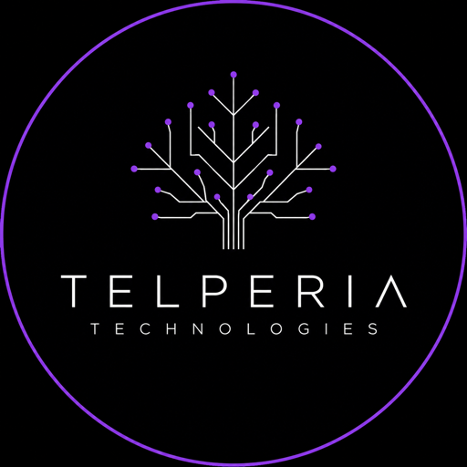

<p align="center">
  
</p>

# Telperia

Telperia is an open, energy-aware AI measurement project for comparing AI model configurations with transparent methodology, reproducible result packages, hardware metadata, verification levels, and local efficiency scoring.

The long-term goal is to build an AI Observatory: a public place where builders, researchers, companies, and local AI users can understand what models can do, how reliable they are, what intelligence costs to run on real hardware, and how much evidence supports each result.

This repository contains the MVP foundation for that system: methodology documents, schemas, a local evaluation runner, NVIDIA telemetry collection, early Windows and Mac result packages, ingestion validation, local backend persistence, backend design docs, and a draft Supabase migration.

## Why Telperia Exists

AI model comparisons are often hard to trust. A score may not explain what was measured, what hardware was used, whether the result can be reproduced, or whether the energy claim reflects the machine actually running inference.

Telperia is designed around a different standard:

- Scores should be tied to versioned methodology.
- Raw measurements should remain separate from calculated scores.
- Public results should include hardware, verification, and limitation metadata.
- Energy claims should clearly say what was measured and what was not measured.
- Prompt and response content should not be collected by default.
- Public submission should be explicit, not automatic.

In plain English: Telperia is trying to make AI performance, hardware-specific efficiency, and local inference energy claims easier to inspect, compare, and challenge.

## What Telperia Measures

### TCI

The Telperia Capability Index, or TCI, is the main MVP capability score. TCI v0.1 combines benchmark category scores using documented weights:

- Reasoning
- Coding
- Mathematics
- Factual knowledge
- Instruction adherence

TCI v0.1 is the active scoring method. A separate `methodology/TCI-v0.2-proposal.md` exists for future improvements, but it is not used for current result packages.

### Factual Reliability

Factual Reliability tracks how a model handles factual questions. It preserves:

- Correct responses
- Incorrect responses
- Abstentions
- Total questions
- Correctness rate
- Incorrect answer rate
- Abstention rate
- Attempted accuracy

This helps separate "the model answered often" from "the model answered correctly."

### Local IPW

Local Intelligence-per-Watt, or Local IPW, measures capability per watt-hour of local GPU energy during an evaluation run.

The MVP formula is:

```text
IPW = TCI x Completion Ratio / GPU Energy in Wh
Displayed IPW = 1,000 x TCI x Completion Ratio / GPU Energy in Wh
```

Telperia always preserves the unscaled IPW value. The displayed value is only a scaled presentation score.

Important limitation: Local IPW is local inference hardware energy. It is not a claim about full data-center energy usage, cloud provider infrastructure, networking, cooling, or upstream training energy.

### Energy Confidence

Energy confidence explains how much trust to place in a Local IPW result. It records sample count, measured duration, warning codes, and whether the energy reading came from a supported hardware telemetry backend such as NVIDIA NVML.

This matters because a short run with only a few GPU power samples is less reliable than a longer repeated run with stable telemetry.

### Verification Levels

Verification levels describe how much evidence supports a result. MVP result packages preserve verification metadata so public readers can tell the difference between a local self-run, a reviewed result, and future higher-confidence submissions.

### Deferred Metrics

TRI and Transparency Score are planned methodology areas, not active MVP scores. The Observatory website explains TRI as a planned reliability metric and shows Transparency Evidence fields, but it does not display numeric TRI or Transparency Score values until those methodologies are approved.

## What Is Built Today

Telperia has completed the local Phase 6 backend foundation, the first Phase 7 static Observatory website shell, and the first Phase 8 separation between the controlled Evaluation Runner and the local-first Telperia Agent.

Completed foundation work includes:

- Versioned methodology documents in `methodology/`.
- Result, telemetry, and inference schemas in `schemas/`.
- A local Ollama evaluation runner in `evaluation-runner/`.
- A 25-task `tci-v0.1` benchmark suite.
- NVIDIA GPU telemetry collection through NVML on supported Linux and Windows machines.
- Mac and non-NVIDIA local-development runs with Local IPW deferred.
- Result packages that preserve raw benchmark data, calculated scores, telemetry metadata, energy confidence, and verification metadata.
- Windows RTX 5070 seed results under `datasets/results/`.
- Repeatability and energy confidence guidance for local testing.
- A local ingestion validator that checks schema validity, privacy rules, score math, IPW math, and raw telemetry consistency.
- A local Phase 6 API skeleton that wraps the validator, models backend ingestion responses, and can persist accepted uploads to SQLite for development.
- A local approved-results read path for future Observatory list and detail views.
- A result validation CLI for checking packages before hosted upload exists.
- Public-safe Observatory row fixtures for future website and API testing.
- A static Observatory website shell with home, model directory, model profile, comparison, methodology, terminology, results table, and result detail views.
- A separate local-first Agent scaffold that can write non-content inference events to JSONL without uploads.
- A Phase 6 backend design, result ingestion contract, API contract, Supabase setup guide, and draft migration.
- Security guidance for secrets, uploads, raw JSON privacy, public review, and release checks.

No hosted Supabase backend or deployed public Observatory website is live yet.

## How A Result Package Works

At a high level, a Telperia result package is created like this:

1. A user runs the local evaluation runner against one Ollama model.
2. The runner executes a predefined public evaluation suite.
3. The telemetry module samples local GPU power when a supported NVIDIA monitor is available.
4. The runner calculates completion ratio, TCI v0.1, Factual Reliability, Local IPW, and energy confidence.
5. The package preserves raw benchmark results and raw telemetry samples separately from calculated scores.
6. The ingestion validator checks the package before backend storage.
7. A public-safe Observatory summary can be extracted without prompt text, response text, secrets, filenames, environment variables, or private machine identifiers.

The validator is intentionally strict. It rejects packages with invalid schema structure, private content fields, inconsistent TCI math, invalid IPW math, impossible raw scores, and telemetry summaries that do not match raw power samples.

## Current Result Packages

The repository currently includes:

- 1 Mac/local development result with Local IPW deferred.
- 11 Windows RTX 5070 NVML results with measured GPU energy and calculated Local IPW.

See `docs/phase-5-results-summary.md` for the current seed result table.

## Current Phase

Phase 8 Step 26 is complete on top of the completed local Phase 6 backend foundation and Phase 7 Observatory shell. The current focus is building the Agent carefully while keeping privacy, local-first behavior, and runner separation clear.

The repo now includes a runnable local HTTP API wrapper around the ingestion validator, a SQLite-backed persistence path for accepted uploads, and an approved-only public read path. It can:

- Store raw JSON privately.
- Persist public-safe summary rows.
- Keep public submission as an explicit opt-in review flow.
- Return only approved public summaries for future Observatory pages.

The next major backend work is to connect these persistence and read boundaries to Supabase with real authentication, private Storage writes, Postgres summary writes, and RLS-backed public reads. That can wait until the local agent and contribution boundaries are clearer.

The first static Observatory shell now exists under `apps/observatory-web/`. It includes homepage positioning, a public model directory, public-safe model profile views, a two-to-four configuration comparison view, seed results, result detail views, official methodology sections, and in-page terminology explanations for the active and deferred MVP metrics. Score labels link back to methodology anchors so public numbers stay tied to versioned definitions.

Phase 8 started with Step 26: separating the Telperia Agent from the Evaluation Runner. The runner performs controlled benchmark sessions. The agent is now a separate local-first program scaffold for non-content telemetry during normal model use. They share telemetry code where appropriate, but remain separate programs with separate responsibilities.

## Repository Map

- `apps/observatory-web/`: static public Observatory shell with seed result, model directory, model profile, and comparison views.
- `apps/api/`: planned backend API and ingestion service.
- `evaluation-runner/`: local benchmark runner and telemetry tooling.
- `agent/`: local-first Telperia Agent scaffold for non-content telemetry during normal model use.
- `methodology/`: versioned methodology, limitations, privacy, and scoring documents.
- `schemas/`: JSON schemas for result packages, telemetry samples, and inference events.
- `datasets/`: benchmark data and seed result packages.
- `docs/`: roadmap, backend design, setup guides, data shape docs, and contributor guides.
- `scripts/`: repository utilities.
- `tests/`: unit tests and ingestion/Observatory fixtures.
- `assets/`: project images used by repository documentation.

## Quick Local Check

Run these from the repository root:

```bash
python3 -m unittest discover -s tests -q
python3 -m compileall -q evaluation-runner tests
python3 evaluation-runner/evaluate.py --help
python3 evaluation-runner/validate_result.py tests/fixtures/ingestion/valid_private_upload.json
python3 agent/agent.py record-once --output .local/telperia-agent/events.jsonl --model-id llama3.1:8b --latency-ms 250 --input-tokens 12 --output-tokens 18
```

Run the local API with SQLite persistence:

```bash
PYTHONPATH=apps/api:evaluation-runner python3 -m telperia_api.http_app --sqlite-db .local/telperia-api.db
```

Open the static Observatory shell locally:

```bash
open apps/observatory-web/index.html
```

## Running Local Evaluations

Basic local runner flow:

```bash
python3 evaluation-runner/evaluate.py --model llama3.1:8b --output result.json
```

Hardware monitor guidance:

- Mac or non-NVIDIA development run: use `--hardware-monitor disabled --node-id local`.
- Linux NVIDIA run: use `--hardware-monitor nvml --node-id linux-laptop`.
- Windows NVIDIA run: use `--hardware-monitor nvml --node-id windows-5070`.

See `evaluation-runner/README.md`, `docs/phase-5-local-experiments.md`, and `docs/windows-test-contributor-runbook.md` for the full workflow.

## Current Limitations

- Local IPW measures local inference hardware energy only. It does not represent full data-center energy.
- Mac machines can generate valid capability result packages, but measured NVIDIA GPU energy is deferred unless compatible telemetry exists.
- TCI v0.1 is an MVP benchmark and should be interpreted as an early methodology, not a final intelligence measure.
- TCI v0.2 is a proposal only and is not implemented in current result packages.
- TRI and Transparency Score are deferred and should be presented as methodology-pending concepts, not live scores.
- Local backend persistence uses SQLite for development; live Supabase Storage/Postgres wiring is not connected yet.
- Public read endpoints currently use local approved SQLite summaries; hosted Supabase public reads are not connected yet.
- The backend migration is drafted but not applied to a live Supabase project yet.
- The Telperia Agent is a local-only scaffold and does not yet run continuously or submit data.
- The public Observatory website shell exists locally, but it is not hosted and the community submission flow is not live.

## How To Explain Telperia

Short version:

> Telperia is building an open AI Observatory for transparent model capability, reliability, and local energy-efficiency measurement.

Slightly longer version:

> Telperia lets people run standardized local AI evaluations, collect hardware and energy telemetry, generate versioned result packages, and compare models with clear methodology and verification metadata. The goal is to make AI performance and efficiency claims easier to inspect instead of relying on unexplained leaderboard numbers.

Founder-style version:

> Telperia exists because AI is becoming infrastructure, but most people still cannot clearly compare what models can do, what hardware they ran on, how reliable their answers were, or how much energy was used during inference. We are building the measurement layer for that problem, starting with local reproducible evaluations and expanding toward a public Observatory.

## Where To Read Next

- `docs/README.md`: recommended documentation reading order.
- `docs/roadmap.md`: MVP phases and current project status.
- `docs/telperia-methodology-v0.1.md`: plain-language methodology overview.
- `methodology/TCI-v0.1.md`: current TCI formula.
- `methodology/IPW-v0.1.md`: current Local IPW formula and caveats.
- `methodology/factual-reliability-v0.1.md`: factual reliability metrics.
- `methodology/verification-levels.md`: evidence quality levels.
- `methodology/deferred-metrics.md`: guidance for TRI, Transparency Score, and other deferred metrics.
- `docs/phase-6-backend-design.md`: backend design for private-by-default ingestion.
- `docs/result-ingestion-contract.md`: ingestion rules and validation expectations.
- `docs/observatory-data-shape.md`: public comparison fields.
- `SECURITY.md`: security and privacy review checklist.
